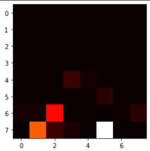
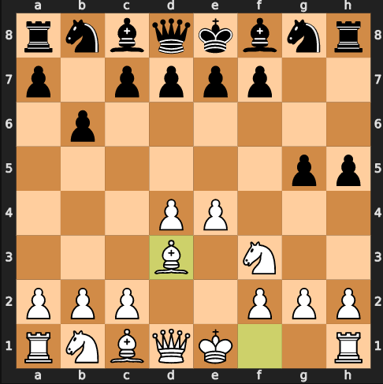

## Chess Engine MVP

**Objective:** Create a chess engine powered by a neural network that can consistently beat a player making random moves.

**Current State:** I have a series of neural network models that take a board state as input and output a predicted move. I also have some wrapper functions that helps to select the correct model and update the board with the chosen move. Currently the engine only plays with the white pieces (though it's straightforward to add black pieces), and it rarely beats the random player. However, it does find valid moves and push them to the board, and its early game play is relatively strong.

### Description of Process

My model takes the board state processed into numeric inputs--an array with length 64 beginning at square A1 and ending at square H8. Blank squares are represented as 0s, and each of the pieces is represented by their point value (pawn = 1, rook = 5, etc). White pieces are positive integers and black pieces are negative integers. I've appended some game metadata onto the end of this board-state array, which includes castling rights, whose turn it is, and whether the king is in check.

My goal was to provide a board state as input and use the next move (played by a 2000+ elo rated player) as the target. However, the decision space for this model was very large, and I would need to track some complicated elements like whether a piece started on the king or queenside of the board. Instead, I decided to break the decision into two stages: selecting a piece (SaP model) and moving a piece (MaP) model. The SaP model has 64 output nodes and uses a softmax activation to find the square to move the piece from; the MaP model has the same 64 output nodes and chooses the destination square for that piece. There are many illegal moves and it is possible for the engine to choose an opponent's piece or a blank square, so I have a helper function that finds the top-ranked legal moves from the softmax output.  

I fit this model and played a game and realized two significant issues:
1. The engine often tried to play with the opponent's pieces.
2. Most games start by playing either e4e6 or d4d6, and these squares were selected as the best moves even into the late game when these squares were empty.

To address the second problem, I recognized that the early, mid, and late game stages of a chess game are played differently: the early game is somewhat formulaic and governed by opening theory, the mid-game is positional and usually requires many trades, the end game requires playing with pieces in positions that are uncommon to the earlier stages in the game; for instance, the white rook may patrol the opponent's 7th rank. To help remedy this, I created separate models for each of those three game stages and added a condition in my function that generates a move to check the turn count to determine which model to use.

Here is the evaluation for each NN:

| Model    | Game Stage  | Loss   | Accuracy |
| -------- | ----------- | ------ | -------- |
| SaP      | Early       | 1.15   |   0.61   |
| SaP      | Mid         | 1.98   |   0.34   |
| SaP      | Late        | 1.61   |   0.40   |
| MaP      | Early       | 0.32   |   0.89   |
| MaP      | Mid         | 1.74   |   0.47   |
| MaP      | Late        | 2.90   |   0.19   |

The SaP models are less accurate in the early game, but perform better in the late game, and the opposite is true for MaP. Intuitively, this makes sense: in the early game, there are many pieces that could be moved given a certain board state, but once a piece is chosen, the number of moves is limited (for example, the knight has only 2 available moves on its starting square). In the late game, there are fewer pieces to move because many will have been captured, however, each of these pieces will have more moves available (the knight in the center of the board has 8 possible moves).

Here is a demonstration of the softmax output (shaped into an 8x8 grid to match the chess board) from the engine and the resulting move on the chess board

White cells show a high rating from the softmax activation. In this case, the engine wanted to move the bishop on f1, but it also considered knight and pawn moves on the other side of the board.

### Next Steps

I've listed a few optimizations below, but first a note on my evaluation metric. Through experimentation, I realized that benchmarking performance against random moves is not a good measure. Random moves cause the NN models to quickly go beyond their training data, since the random moves are so nonstandard. When I play normal moves against the engine, it performs far better through the early and mid game. However, it still falls apart in the late game because it gets stuck shuffling around pieces rather than improving its position.

**Potential Optimizations**
1. I've built this model using only dense layers, however I'd like to try adding convolutional layers to see if they will help the engine see useful move patterns anywhere on the board (like a pawn capturing diagonally on the opponents back rank)
2. Currently I move from early -> mid -> late game by tracking turn count. Instead, I'd like to try advancing the game stage based on pieces remaining on the board. 
3. I would like to try splitting out the MaP neural networks into separate models for each piece. The SaP model might choose a pawn move, for instance, and I'll then pass the MaP decision to a NN built with only pawn-move training data. I think that this change might reduce the amount of piece-shuffling in the late game.
